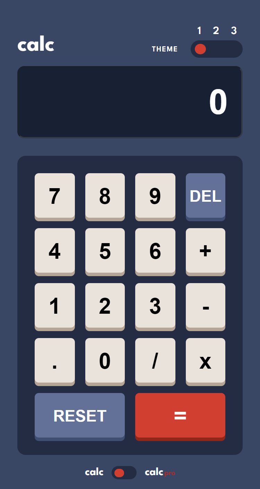
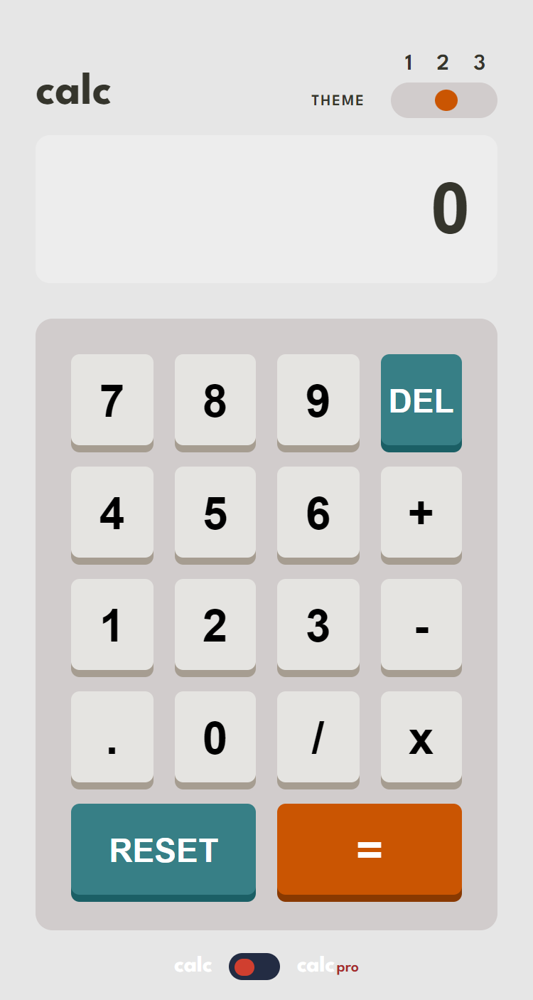

## Table of contents

- [Overview](#overview)
  - [The challenge](#the-challenge)
  - [Screenshot](#screenshot)
  - [Links](#links)
- [My process](#my-process)
  - [Built with](#built-with)
- [Author](#author)

## Overview

### The challenge

Users should be able to:

- See the size of the elements adjust based on their device's screen size
- Perform mathmatical operations like addition, subtraction, multiplication, and division
- Adjust the color theme based on their preference

### Screenshot

### Links

- Solution URL: [GitHub](https://github.com/thisisadelakun/calc-app)
- Live Site URL: [calc App](https://thisisadelakun.github.io/calc-app/)

## My process

### Built with

- Semantic HTML5 markup
- CSS custom properties
- Flexbox
- CSS Grid
- Mobile-first workflow
- Javascript

## Author

- LinkedIn - [Adelakun Abayomi](https://www.linkedin.com/in/abayomi-adelakun-897227178/)
- Portfolio - [Adelakun Abayomi](https://adelakunportfolio.netlify.app/)
- Frontend Mentor - [@thisisadelakun](https://www.frontendmentor.io/profile/thisisadelakun)
- Twitter - [@yourusername](https://www.twitter.com/thisisadelakun)

